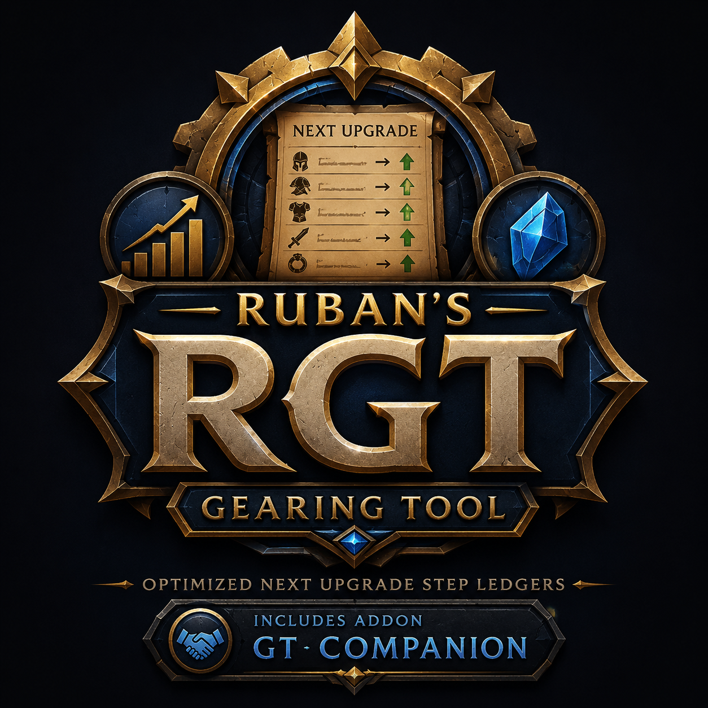

<p align="center">
  
</p>

<h1 align="center">Ruban's Gearing Tool (RGT)</h1>

<p align="center">
  Real gear-upgrade rankings for WoW Classic: The Burning Crusade (Anniversary), driven by
  <a href="https://github.com/wowsims/tbc-new">wowsims/tbc-new</a>'s own simulation engine.
</p>

---

## What it does

Every "is this an upgrade" question in WoW comes down to one thing: does it raise your actual DPS.
RGT answers that by running your real character through wowsims' own simulator for every candidate
item, gem, and enchant combination, and reports upgrades by **marginal value** - not stat-weight
guesswork:

```
MV(i) = DPS*(P ∪ {i}) − DPS*(P)
```

`DPS*(S)` is the best DPS achievable from your gear pool `S` under every equip constraint - never
a per-slot "swap and re-sim" shortcut. That shortcut undervalues set-completing items (each piece
looks mediocre alone) and overvalues hit/expertise once you're already capped. Stat weights are a
cheap linear approximation of this; RGT exists to be right exactly where that approximation breaks
- thresholds, set bonuses, stacked procs, weapon-speed rotation changes.

## Features

- **15 real class/spec profiles** - Survival & Beastmastery Hunter, Arms & Fury Warrior, Balance &
  Feral Cat Druid, Elemental & Enhancement Shaman, Combat Rogue, Shadow Priest, Arcane Mage,
  Retribution Paladin, and Affliction/Demonology/Destruction Warlock.
- **A real upgrade ledger, not a stat-weight guess** - every candidate is a genuine sim run against
  your actual gear, gems, and enchants, tiered by real acquisition source (raid drop, reputation,
  crafted, etc.).
- **Set bonuses, procs, and thresholds handled correctly** - because upgrades are evaluated against
  your whole gear pool, not swapped in isolation.
- **Interaction detection** - flags item pairs whose combined value differs from the sum of their
  individual values (trinket synergies, set-completing pieces).
- **A companion in-game addon** ([GT Companion](addons/GearingToolCompanion)) that captures bank,
  bag, reputation, and arena data no other export addon reaches.
- **A desktop GUI** (character picker + report viewer) alongside the CLI.

## Status

Actively developed, pre-release. 15 class/spec profiles are built and verified; a packaged
Windows installer exists but hasn't been published as a GitHub Release yet. If you want to run it
today, you'll need to build from source - see below.

## Building from source

Requires Python 3.13, Go 1.26+, and `protoc`. Full setup and build steps (including the vendored
sim submodule and its own build quirks) are in [`CLAUDE.md`](CLAUDE.md)'s "Local setup" section.

```bash
git clone --recurse-submodules https://github.com/Ruban-Creator/wow-gearing-tool.git
cd wow-gearing-tool
pip install -r requirements.txt
# then follow CLAUDE.md's "Local setup" for the Go/protobuf build steps
```

Day to day, once built:

```bash
python cli/gear.py sync                          # re-read your in-game export
python cli/gear.py best <name-realm> <phase>      # run the upgrade ledger
# or: python gui/app.py for the desktop app
```

## Architecture

```
core/        MV optimizer - engine-agnostic, dict-based, knows nothing about classes or expansions
adapters/    Sim adapter - talks to wowsims' own compiled CLI as a subprocess
ingest/      Reads addon SavedVariables into a character.json
profiles/    Per-class/spec data - candidate pools, reference BiS, stat weights, raid buffs
gui/         Desktop app (character picker + report viewer)
addons/      GT Companion, the in-game companion addon
```

See [`CLAUDE.md`](CLAUDE.md) for the full architecture writeup and ground rules this project holds
itself to (never invent data, noise-honest DPS reporting, deterministic seeds).

## Credits

This tool exists entirely because of the [wowsims](https://github.com/wowsims/tbc-new) team's own
simulation engine - huge thanks to them and every contributor. If you find RGT useful, consider
[supporting wowsims on Patreon](https://www.patreon.com/wowsims) or joining
[their Discord](https://discord.gg/jJMPr9JWwx).

## License

[MIT](LICENSE)
